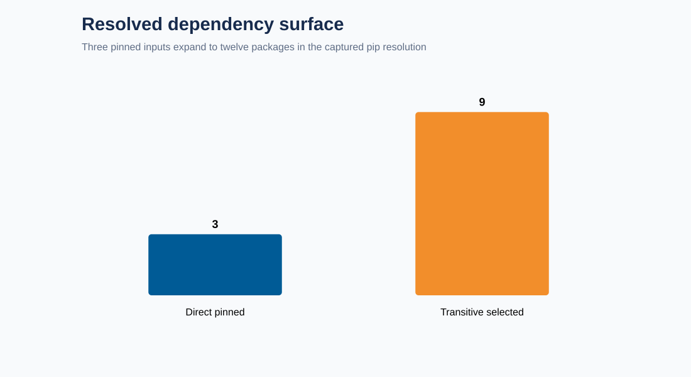
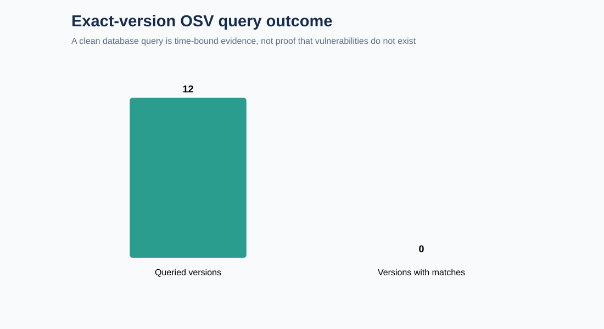

# Portfolio Supply-Chain Audit

A reproducible dependency and vulnerability audit of my published [rideshare marketplace analysis](https://github.com/KeyurDesai53987/rideshare-marketplace-analysis). The project resolves the repository's actual pinned requirements, captures the complete pip resolution report, queries every exact PyPI version against OSV, and preserves the evidence behind every conclusion.

No sample CVEs, generated packages, or hypothetical exposures are used.

## What the audit found

The three direct pinned dependencies resolved to **12 packages** in the captured Python 3.14/macOS ARM64 environment. Nine packages were transitive and therefore were not pinned in the source requirements file.



That is the primary reproducibility finding: the direct versions are fixed, but a clean installation performed later can select different transitive versions as compatible ranges and package indexes change. The captured `pip-resolution.json` provides an auditable bill of materials for this run; it does not turn the original requirements file into a lockfile.

OSV returned **zero known vulnerability records** for the 12 exact versions queried on August 13, 2026.



This means only that OSV had no matching records at retrieval time. It does not prove that the packages are secure, that every vulnerability database is complete, or that vulnerable code would be unreachable if a match existed.

## Evidence chain

1. `data/raw/source-requirements.txt` is extracted with `git show` from the exact rideshare commit recorded in `source-manifest.json`; uncommitted working-tree changes cannot enter the snapshot.
2. pip resolves those requirements with `--dry-run --ignore-installed --report`, capturing selected versions and distribution metadata without installing them.
3. Every resolved `(package, version)` pair is sent to the official OSV `querybatch` endpoint.
4. Any returned identifiers are retrieved individually so affected ranges, references, aliases, and fixes remain reviewable.
5. SHA-256 hashes bind all three raw inputs to the manifest.
6. Validation checks package uniqueness, query-response alignment, hashes, and complete OSV-detail coverage.
7. `data/processed/requirements.lock` pins all 12 resolved versions to their selected distribution SHA-256 values.

## Reproduce

```bash
python src/ingest.py
python -m unittest discover -s tests -v
python src/validate.py
python src/analyze.py
python src/create_charts.py
```

Acquisition requires network access, pip, and the sibling rideshare repository. The checked-in snapshot allows the remaining steps to run offline.

Reinstall the captured platform-specific package set with hash verification:

```bash
python -m pip install --require-hashes -r data/processed/requirements.lock
```

## Design decisions

- Exact-version queries avoid the false positive of attaching every package-level advisory to every version.
- OSV pagination is checked. The collector refuses to accept a truncated response rather than silently undercounting.
- Direct and transitive dependencies remain distinct.
- A database match is called an exposure record, not an exploitable incident.
- A clean query is reported as “no known match,” never “secure.”
- Severity is not invented when an advisory omits a standardized score.
- Workflow actions are pinned to full commit SHAs rather than movable major-version tags.

## Boundaries

- pip resolution depends on Python version, operating system, architecture, index state, and environment markers.
- This snapshot used Python 3.14 on macOS ARM64; deployment environments may resolve differently.
- The generated lock is deliberately platform-specific; a different deployment target requires its own captured resolution and hashes.
- The audit covers Python packages in one published project, not operating-system, container, GitHub Action, or source-code vulnerabilities.
- OSV is an aggregator of public vulnerability databases; absence from OSV is not proof of absence.
- Dependency reachability and exploitability require application-specific analysis and are outside this dataset.

## Repository map

```text
data/raw/          source requirements, pip report, OSV responses, manifest
data/processed/    package-level exposure table and hashed lock
results/           derived summary
assets/            charts generated from the results
src/               acquisition, validation, analysis, visualization
tests/             tests against captured factual records
docs/              threat model and decision record
```

Sources: [OSV API documentation](https://google.github.io/osv.dev/api/) and the pinned rideshare requirements link in `data/raw/source-manifest.json`.

The MIT license covers original code and documentation in this repository. Captured third-party metadata and vulnerability records retain their source licenses; see `THIRD_PARTY_NOTICE.md`.
